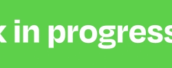

<h1 align="center">

</h1>

# Hi there 👋

Hello! 👋 I'm **_Marcelo_**, a software development student at **MITT**. I have experience with **_HTML, CSS, and JavaScript_** and am currently cursing a Full Stack program. I'm passionate about building efficient, user-friendly web applications and eager to take on new challenges in software development.

## My Skills

  
  
  
  
  

## About Me 👨‍💻

- 🎓&nbsp; Studying **_Software Development_** at **MITT**.
- 🗣 &nbsp; Languages: **_English_** and **_Portuguese_**.
- 🌱&nbsp; I’m currently learning **_C#_** and **_C++_**.
- 🤔&nbsp; I like to explore new features and learn new things about everything.
- 💬&nbsp; Ask me about anything, I am happy to help.

## My Tech Stack 💻

- 💻 &nbsp; **HTML** | **CSS** | **JavaScript** |
- 🌱 &nbsp; **_Current learning_** more about **C#** and **C++**.
- 🌱 &nbsp; I’m currently in the **_Full Stack_** program at **_MITT_**.
  
## Let's Connect 🤝

- Still working on it 😅

##

