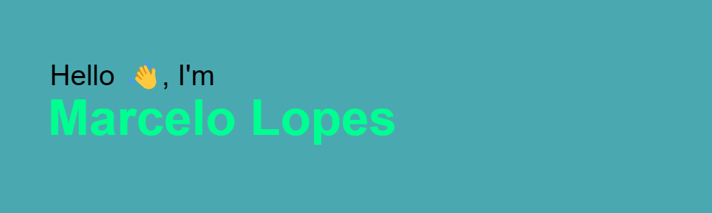

# Hi there 👋

 I'm **_Marcelo Lopes_**, a software development student from **MITT** based in Winnipeg, Canada🍁. 
 
 I'm currently pursuing a Full Stack program, honing my skills in **_HTML, CSS, and JavaScript_**. I'm passionate about creating efficient, user-friendly web applications and always eager to embrace new challenges in the field of software development.

Welcome to my GitHub profile! This is where I showcase my projects and progress as a developer. I appreciate any feedback or suggestions you might have, so feel free to explore and share your thoughts.

## My Skills

  
  
  
  
  

## My Tech Stack 💻

- 💻 &nbsp; **HTML** | **CSS** | **JavaScript** |
- 🌱 &nbsp; **_Current learning_** more about **C#** and **C++**.
- 🌱 &nbsp; Full Stack Development **_in progress_**.

## About Me 👨‍💻

- 🎓&nbsp; Studying **_Software Development_** at **MITT**.
- 🗣 &nbsp; Languages: **_English_** and **_Portuguese_**.
- 🤔&nbsp; I like to explore new features and learn new things about everything.
- 💬&nbsp; Ask me about anything, I am happy to help.

## Let's Connect and Projects 🤝

- Still working on it 😅

##

